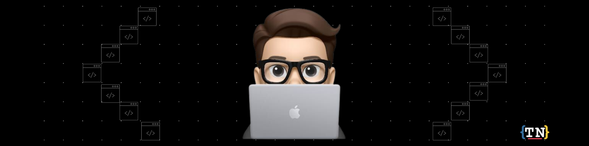

  
<h2 align="center">Hi 👋, I'm Tyler Nguyen</h2>
<h5 align="center">A passionate full stack developer</h5>

## 💫About Me:
- :office: I'm currently working on C# Stack
- :books: Learning MERN Stack and practicing
- :hourglass_flowing_sand:  Exploring all amazing AWS Services
- :trophy: Won "Best First Time Hack" - PlutoHacks 2021
- :trophy: Won "Best Web Monetization Project" - Major League Hacking 2021
- :camera: I taught myself how to use camera, drone, Gopro, photo editing, video editing
- :zap: Fun fact: I love to attend Meetups for learning & Conferences for Networking
- 💭 Motivation Quote: "Don't underestimate the power of coffee and a person with a dream"
- 📫 Best Reach me @: Tylernguyen33325@gmail.com

## 💻Tech Stack

  
<b>✨&nbsp;&nbsp;Languages&nbsp;</b>

   

  
<b>🌟&nbsp;&nbsp;Tools</b>

   

## 📊Stats:
 

## Connect with me:

  

